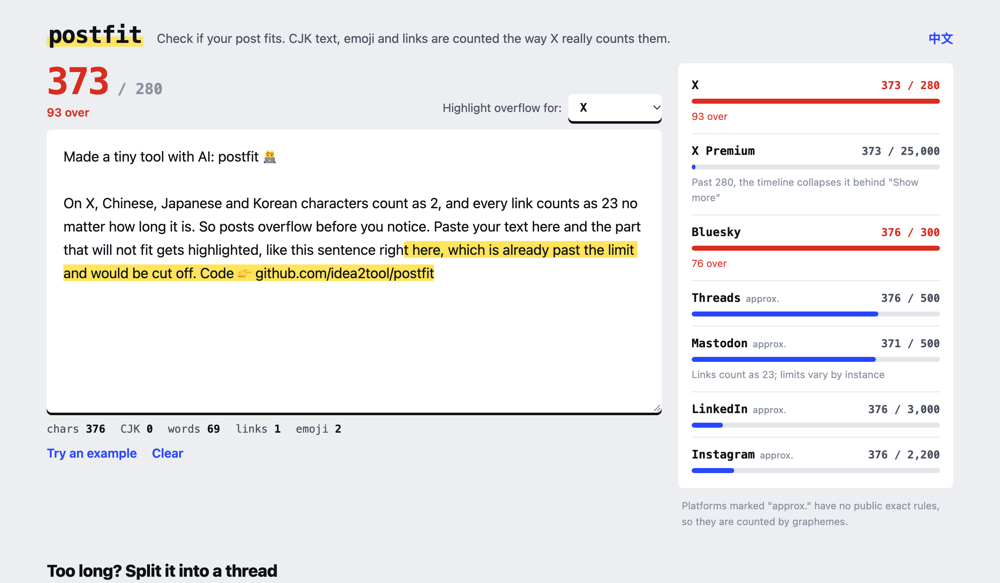

# postfit

**Does your post fit?** Paste your text and see how it counts on X, Bluesky, Threads, Mastodon, LinkedIn and Instagram. The part that won't fit gets highlighted, and long text can be split into a thread.

**Try it →** https://idea2tool.github.io/postfit/ · [see a demo](https://idea2tool.github.io/postfit/?demo)

[中文说明](#中文说明)



## Why

On X, Chinese, Japanese and Korean characters count as **2**, most emoji count as **2**, and every link counts as **23** no matter how long it is. If you write in CJK or use a lot of emoji, posts overflow long before you expect. postfit shows you exactly where the limit is.

## Features

- Live counts for X, X Premium, Bluesky, Threads, Mastodon, LinkedIn and Instagram
- Highlights the exact part that goes over the limit
- X Premium: shows where the timeline collapses your post behind "Show more" (280)
- Splits long text into a thread, breaking at paragraphs and sentences first, with optional `1/3` numbering
- Stats: characters, CJK characters, words, links, emoji
- English and Chinese UI
- Single page, no dependencies, no tracking

## How accurate is it?

| Platform | How it counts | Source |
|---|---|---|
| X | Exact. Weighted by Unicode range, emoji = 2, links = 23, NFC-normalized | [twitter-text config v3](https://github.com/twitter/twitter-text/blob/master/config/v3.json) |
| Bluesky | Exact. 300 graphemes | [AT Protocol lexicon](https://github.com/bluesky-social/atproto/blob/main/lexicons/app/bsky/feed/post.json) |
| Threads, Mastodon, LinkedIn, Instagram | Approximate. Counted by graphemes | No public exact algorithm |

A note on emoji: the `twitter-text` package on npm has an outdated emoji list, so it counts newer emoji such as 🧑‍💻 as 5 and 🫶🏻 as 4. I checked them in the x.com composer, and X itself counts both as 2. postfit follows the website.

Run the tests:

```bash
node test/count.test.mjs
```

## Privacy

Everything runs in your browser. Nothing is uploaded. Your draft is saved in `localStorage` on your device only.

## Run locally

The page loads `count.js` as an ES module, so it needs a local server:

```bash
python3 -m http.server 5174
```

Then open http://127.0.0.1:5174/

Made with AI by [@idea2tool](https://github.com/idea2tool). MIT License.

---

## 中文说明

**推文字数计算器**：把要发的内容粘贴进来，就能看到在 X、Bluesky、Threads、Mastodon、LinkedIn、Instagram 上各算多少字。超出上限的部分会用荧光笔标出来，太长还能一键拆成串推。

**在线使用 →** https://idea2tool.github.io/postfit/?lang=zh · [看演示](https://idea2tool.github.io/postfit/?lang=zh&demo)


**为什么需要它**：在 X 上，中日韩文字每个算 **2**，大部分 emoji 算 **2**，链接不管多长都算 **23**。用中文发推，经常写到一半才发现超了。

- 各平台实时计数，超出部分标黄
- X Premium：标出时间线折叠成「显示更多」的位置（280）
- 拆成串推：优先在段落、句子结尾断开，可以加「1/3」编号
- X 和 Bluesky 按官方规则精确计算；其他平台没有公开算法，标「约」
- 全部在浏览器里运行，不上传；草稿只保存在你自己的设备上
